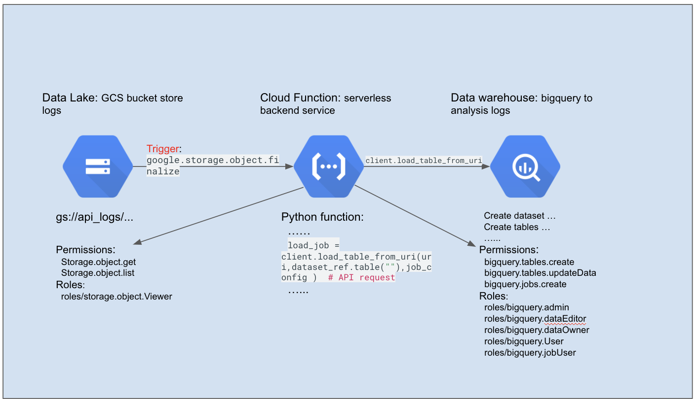

# USE CASE: Trigger on GCS bucket using cloud function load logs to Big Query

## Design Diagram

## Details
* Terraform code
    * [GCS](https://github.com/andy0301/my_practice/tree/master/gcp_course/terraform/gcs)
    * [Big Query](https://github.com/andy0301/my_practice/tree/master/gcp_course/terraform/bigquery) 
    * [Cloud functions](https://github.com/andy0301/my_practice/tree/master/gcp_course/terraform/cloud_function)
* Python Cloud Function code
    * [Load logs from GCS to BigQuery](https://github.com/andy0301/my_practice/tree/master/gcp_course/terraform/cloud_function/load_gcs_to_bq)