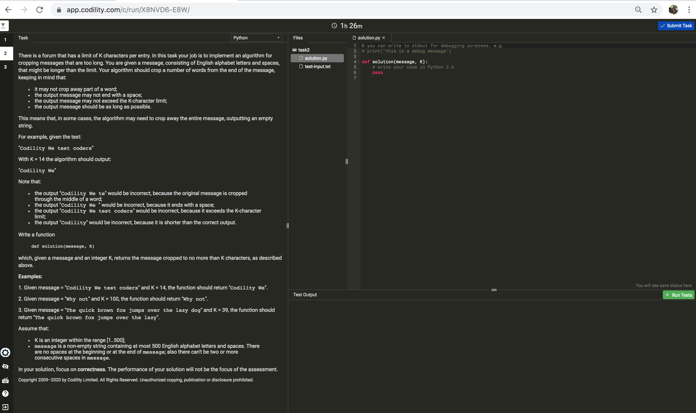
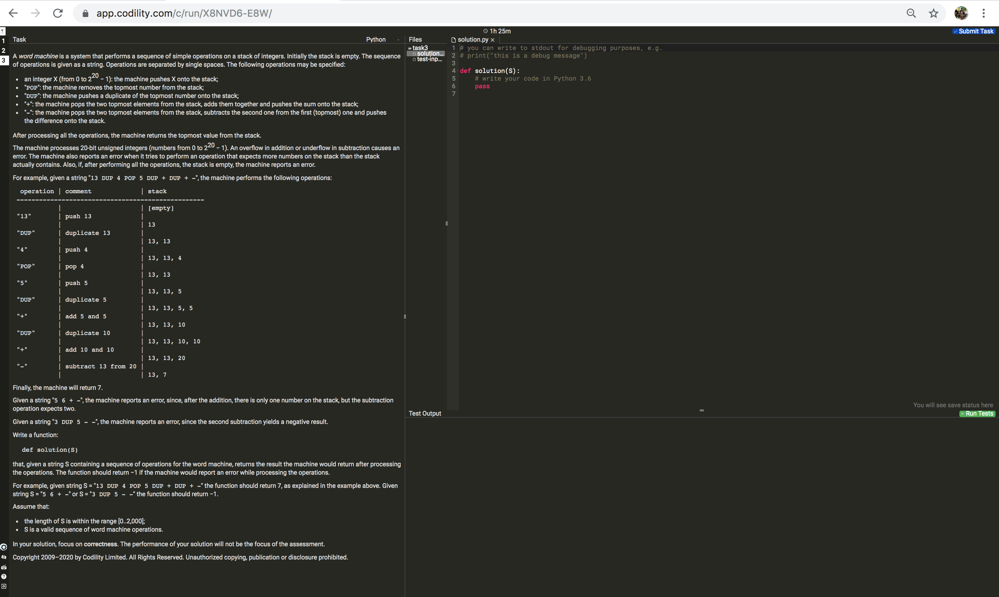

# test1.py
Given an integer n, return any array containing n unique integers such that they add up to 0.

# test2.py
The descriptions is in below pic: 

# test3.py
The descriptions is in below pic: 
